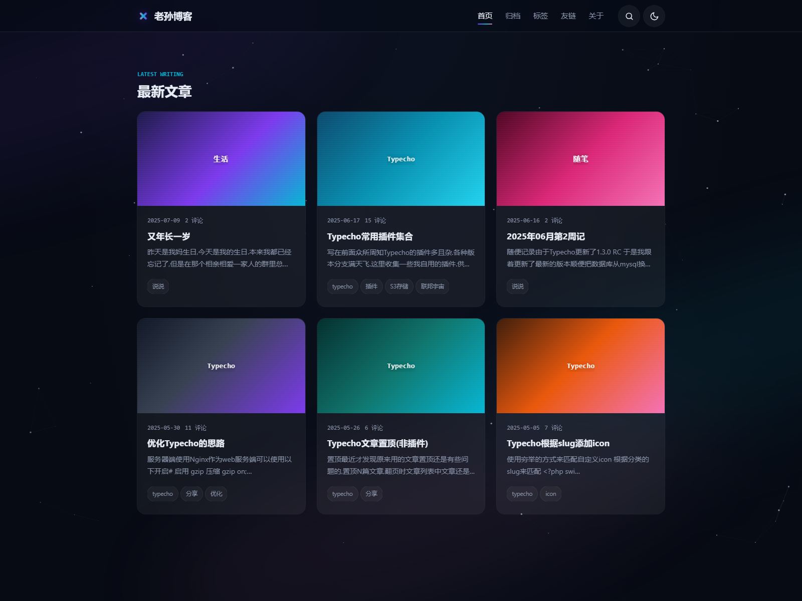

# Nebula

Nebula 是一款面向 Typecho 的响应式博客主题，采用深空、星云与极光风格，适用于个人博客、技术博客和长期内容归档。



## 功能特性

- 响应式文章卡片，适配桌面、平板和移动端
- 深色与浅色模式切换，并记忆访客偏好
- Canvas 动态星空背景与轻量滚动动画
- 文章自定义封面、正文首图回退和渐变占位封面
- 文章、独立页面、搜索、分类、标签和作者归档
- 时间线归档、分类目录、标签云和友情链接页面
- 嵌套评论、评论回复和移动端评论布局
- macOS 风格代码块、语言标识、代码复制和长代码换行
- 长链接与连续字符串自动换行，避免内容超出容器
- 页脚 RSS 订阅、附加文字和自定义统计代码
- 静态资源自动追加主题版本号，便于刷新 CDN 缓存
- GitHub Release 在线检查与主题目录覆盖升级

## 技术栈

| 层级 | 技术 |
| --- | --- |
| 博客系统 | Typecho Widget、模板与主题设置 API |
| 服务端 | PHP 8.0+，Typecho 数据库抽象层 |
| 页面结构 | 语义化 HTML5、Schema.org 文章标记 |
| 样式 | 原生 CSS、CSS Variables、Grid、Flexbox、媒体查询 |
| 前端交互 | 原生 JavaScript，无 jQuery 和前端框架依赖 |
| 动效 | Canvas 2D 星空、IntersectionObserver、CSS Transition |
| 内容处理 | DOMDocument 或正则提取文章正文首图 |
| 在线更新 | GitHub REST API、cURL、ZipArchive |

主题不依赖 Node.js、npm、Composer 或前端构建工具，上传源码后即可由 Typecho 直接加载。

## 环境要求

- Typecho 1.2 或更高版本
- PHP 8.0 或更高版本
- PHP `mbstring` 扩展
- 推荐启用 `dom` 扩展，用于可靠提取正文首图
- 检查在线更新需要 PHP `curl` 扩展
- 安装在线更新需要 PHP `zip` 扩展和可写的主题目录
- 服务器需要能够访问 `api.github.com`、`github.com` 和 `raw.githubusercontent.com`

## 安装主题

### 下载 Release

1. 打开 [GitHub Releases](https://github.com/jkjoy/typecho-theme-nebula/releases)。
2. 下载最新版本的源码压缩包并解压。
3. 将主题目录上传到 Typecho 的 `usr/themes/` 目录。
4. 登录 Typecho 后台，进入“控制台 -> 外观”。
5. 启用 Nebula，并打开“设置外观”完成主题配置。

主题目录可以命名为 `nebula` 或 `typecho-theme-nebula`，但目录中应直接包含 `index.php`、`functions.php` 和其他主题文件，不能额外嵌套一层压缩包目录。

### 使用 Git

在 Typecho 的主题目录中执行：

```bash
git clone https://github.com/jkjoy/typecho-theme-nebula.git nebula
```

然后在 Typecho 后台启用 Nebula。

## 创建独立页面

导航中的归档、标签、友链和关于页面需要在 Typecho 后台创建对应的独立页面。页面缩略名必须与下表一致，主题会根据缩略名自动加载对应页面。

| 页面 | 建议标题 | 缩略名 |
| --- | --- | --- |
| 文章归档 | 归档 | `archives` |
| 分类目录 | 分类 | `categories` |
| 标签云 | 标签 | `tags` |
| 友情链接 | 友链 | `links` |
| 关于页面 | 关于 | `about` |

操作步骤：

1. 进入 Typecho 后台“管理 -> 独立页面”。
2. 新建页面并填写标题。
3. 展开页面高级选项，将“缩略名”设置为上表中的值。
4. 发布页面。

归档页面会显示文章数、分类数、评论数和建站天数。建站天数从最早一篇已发布文章的发布时间开始计算。

## 主题设置

进入 Typecho 后台“控制台 -> 外观 -> 设置外观”进行配置。

| 设置项 | 说明 |
| --- | --- |
| Logo 地址 | 导航栏 Logo 图片 URL；留空时显示站点名称和主题标记 |
| Favicon 地址 | 浏览器标签页图标 URL；留空时使用主题内置图标 |
| 友链 | Links 数据表无有效数据时使用的备用友链列表 |
| 页脚附加文字 | 备案号、版权信息等内容，支持基础 HTML |
| 统计代码 | 在页面关闭 `head` 标签前原样输出，只应填写可信脚本 |

站点名称、站点地址和站点描述使用 Typecho 的全局设置，无需在主题中重复填写。

## 设置文章封面

编辑文章时，主题会在“自定义字段”区域提供以下字段：

| 字段 | 用途 |
| --- | --- |
| `cover` | 文章列表封面图片 URL |
| `coverLabel` | 显示在封面上的文字标签 |

封面读取顺序：

1. 使用文章自定义字段 `cover`。
2. `cover` 为空时，使用文章正文中的第一张图片。
3. 正文没有图片时，显示主题内置渐变封面。

`coverLabel` 为空时使用文章的第一个分类；文章没有分类时显示 `NEBULA`。

## 配置友情链接

主题优先读取 Links 插件使用的 `links` 数据表。只有数据表不存在或没有有效记录时，才会读取主题设置中的备用内容。

主题设置中的友链每行一条，格式如下：

```text
站点名称|https://example.com|站点描述|https://example.com/logo.png
```

头像地址和描述可以留空，例如：

```text
示例博客|https://example.com
另一个站点|https://example.org|记录技术与生活
```

当主题设置中填写了 Logo 地址时，友链页面的“交换友链”区域也会显示本站 Logo 地址。

## 使用代码块

使用 Markdown 围栏代码块并在反引号后填写语言名称：

````markdown
```php
echo 'Hello, Nebula!';
```
````

渲染后代码块会显示语言名称和复制按钮。未指定语言时显示 `TEXT`。长代码会保留原始空格和换行，并在达到容器边缘时自动折行。

## 在线更新

主题设置页顶部提供“检查更新”按钮。

1. 点击“检查更新”连接 GitHub 获取最新版本。
2. 有新版本时页面会显示版本号和“立即升级”按钮。
3. 点击“立即升级”后，主题会下载、校验并解压升级包。
4. 校验通过后使用升级包中的同名文件覆盖当前主题目录。

更新器优先读取最新 GitHub Release；Release 不可用时才回退读取 `main` 分支。为了让已安装主题稳定识别新版本，正式版本应同时更新 `index.php` 中的 `@version` 并发布对应的 GitHub Release。

升级前建议自行备份主题目录，特别是直接修改过主题源码的站点。在线升级会覆盖升级包中存在的同名文件。

## 静态资源缓存

主题自动在 CSS 和 JavaScript 地址后添加版本参数，例如：

```text
assets/css/style.css?v=1.0.2
assets/js/main.js?v=1.0.2
```

发布新版本时修改 `index.php` 中的 `@version`，CDN 和浏览器就会请求新的资源 URL。

## 目录结构

```text
nebula/
|-- assets/
|   |-- css/                 # 前台与更新面板样式
|   `-- js/                  # 前台交互与更新面板逻辑
|-- inc/
|   `-- NebulaThemeUpdater.php
|-- archive.php              # 搜索、分类、标签等归档列表
|-- comments.php             # 评论与回复
|-- footer.php               # 页脚与前台脚本
|-- functions.php            # 设置、字段和主题辅助函数
|-- header.php               # 页面 head、导航与搜索
|-- index.php                # 首页文章列表及主题元信息
|-- nebula-update.php        # 管理员更新接口
|-- page.php                 # 普通独立页面与特殊页面分发
|-- page-archives.php        # 时间线归档
|-- page-categories.php      # 分类目录
|-- page-links.php           # 友情链接
|-- page-tags.php            # 标签云
|-- post.php                 # 文章详情
`-- screenshot.png           # Typecho 主题预览图
```

## 常见问题

### 独立页面打开后没有使用专用布局

检查页面缩略名是否严格使用 `archives`、`categories`、`tags` 或 `links`，不要填写中文缩略名。

### 文章列表没有封面图片

确认 `cover` 是可公开访问的完整图片 URL，或在正文中插入至少一张图片。两者都没有时显示渐变封面属于正常行为。

### 友情链接没有读取插件数据

确认数据库中存在 `links` 表，并且记录的 `state` 为 `1`、`url` 是有效的 HTTP 或 HTTPS 地址。没有有效记录时主题会自动使用设置外观中的备用友链。

### 无法检查或安装更新

依次检查服务器是否可以访问 GitHub、PHP 是否启用 `curl`、当前后台登录状态是否有效。安装阶段还需要 `ZipArchive` 和主题目录写权限。

## 项目地址

- GitHub：https://github.com/jkjoy/typecho-theme-nebula
- 作者网站：https://imsun.org
